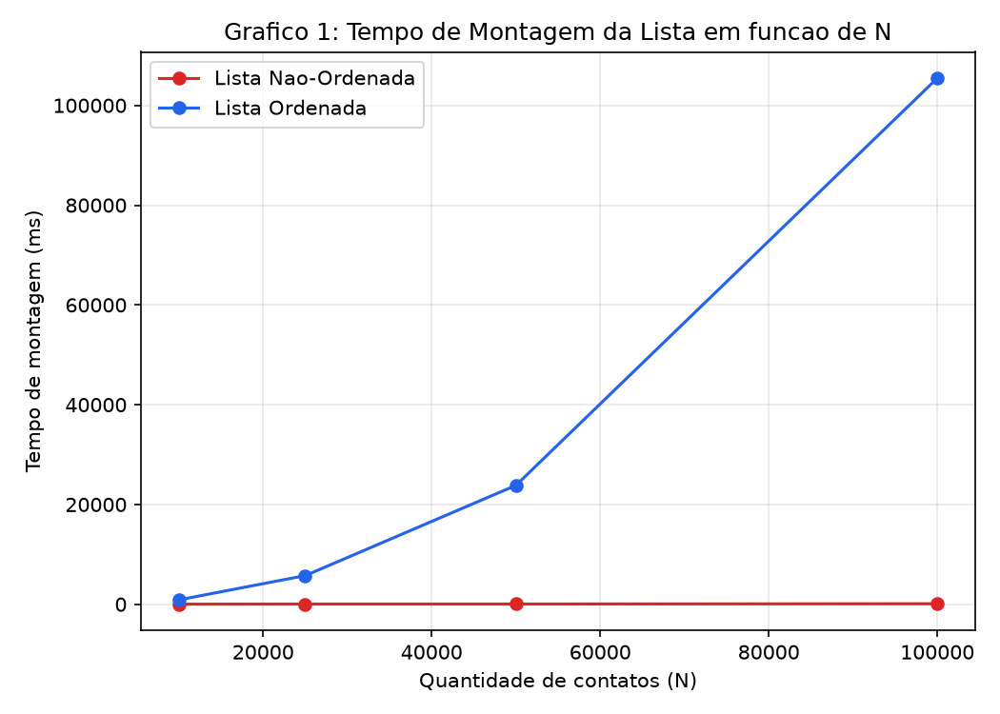
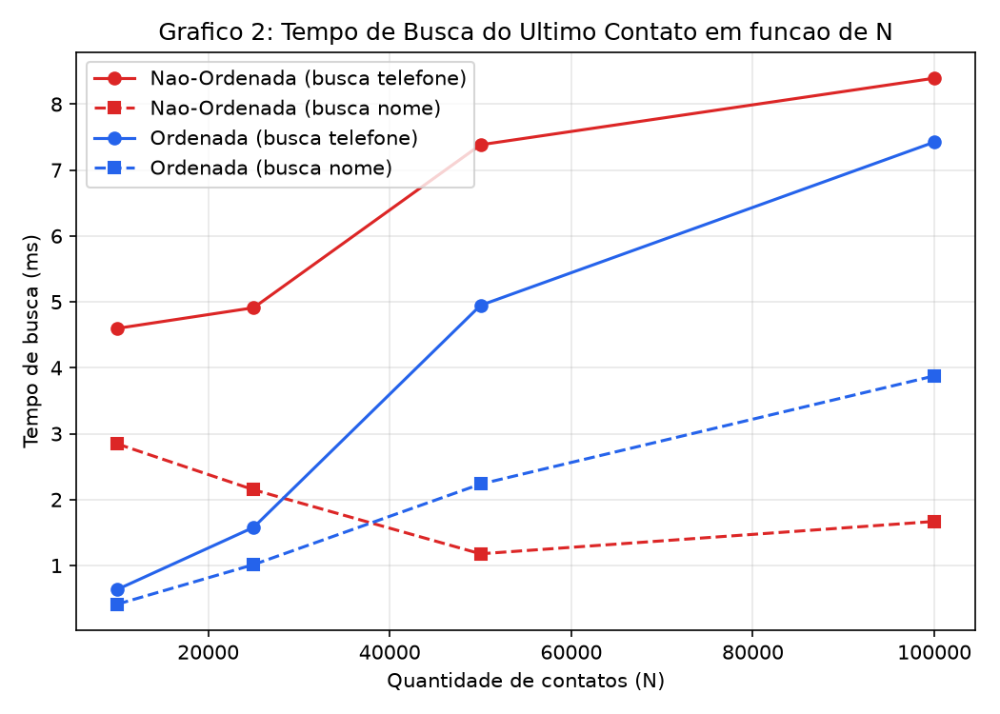
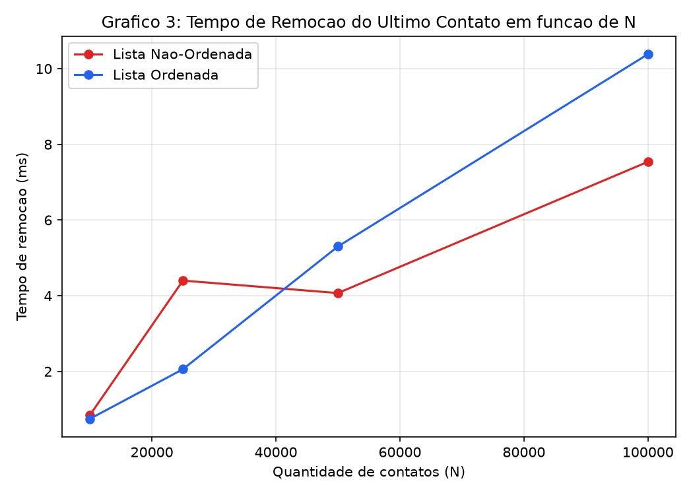

# Instituto Federal do Espírito Santo - Campus Colatina
## Curso de Bacharelado em Sistemas de Informação
### Disciplina: Técnicas de Programação Avançada
### Docente: Prof. Victorio Albani de Carvalho

---

# Relatório Técnico: Trabalho 1 - Análise de Complexidade em Estruturas de Listas

**Integrantes do Grupo:**
- Levi Monteiro
- Matheus Abreu
- Bernardo

**Repositório no GitHub:** https://github.com/bs20242/tpa-trabalho1-etapa1

---

## 1. Relato sobre o Desenvolvimento da Biblioteca e do Programa de Teste

### 1.1 Atuação dos Componentes do Grupo

| Frente de trabalho | Descrição | Integrante(s) responsável(is) |
| --- | --- | --- |
| Biblioteca genérica (`IColecao`, `No`, `ListaEncadeada`) | Estrutura de nós encadeados e lista genérica com suporte a `Comparator<T>` e ao parâmetro `ordenada`; testes automatizados (`TesteLista`) | Levi Monteiro, Matheus Abreu, Bernardo |
| Domínio e aplicação interativa (`Contato`, `ProgramaContatos`) | Modelagem de `Contato`, comparadores por nome e por telefone, menu interativo de 7 opções com medição de tempo | Levi Monteiro, Matheus Abreu, Bernardo |
| Benchmarks empíricos e análise matemática | Gerador de dados sintéticos (`GeradorDadosContatos`), benchmark automatizado (`BenchmarkListas`), dedução matemática linha a linha, tabelas e gráficos | Levi Monteiro, Matheus Abreu, Bernardo |

> Divisão de tarefas registrada de forma coletiva; ajustar por integrante se o grupo quiser detalhar a contribuição individual de cada um.

### 1.2 Detalhamento da Implementação do Programa de Teste

Para testar a biblioteca e exemplificar o seu uso, foi desenvolvido um sistema completo de gerenciamento de contatos. A arquitetura foi dividida em duas classes principais:

* **Classe `Contato`** (`src/dominio/Contato.java`): modelo de domínio com atributos `nome` e `telefone`, sobrescrita de `toString()` retornando os dados separados por hífen, e dois comparadores internos (`ComparadorPorNome`, case-insensitive, e `ComparadorPorTelefone`).
* **Classe `ProgramaContatos`** (`src/app/ProgramaContatos.java`): núcleo interativo via linha de comando. O programa pergunta se as listas devem ser ordenadas ou não e, em seguida, instancia duas estruturas do tipo `IColecao<Contato>` — uma indexada por nome e outra por telefone.

**Decisões arquiteturais e regras de negócio:**
* **Sem duplicação de objetos em memória:** as duas listas (`listaPorNome` e `listaPorTelefone`) armazenam referências para as mesmas instâncias de `Contato`, evitando duplicar dados.
* **Isolamento da regra de negócio:** a restrição de telefone único é verificada inteiramente em `ProgramaContatos` antes da inserção, mantendo a `ListaEncadeada` genérica e livre de regras específicas do domínio.
* **Auditoria de tempo:** carga do arquivo, buscas, remoções e alterações feitas pelo usuário no menu são instrumentadas com `System.nanoTime()` e exibem o tempo gasto em milissegundos.

### 1.3 Utilização de Ferramentas de Inteligência Artificial

Neste trabalho, um assistente de IA (Claude, via Claude Code) foi utilizado com os seguintes propósitos específicos:

- **Implementação do gerador de massa de dados e do benchmark automatizado:** as classes `testes.GeradorDadosContatos` (geração de contatos sintéticos com telefones únicos, sem repetição) e `testes.BenchmarkListas` (carga de arquivo + busca por telefone + busca por nome + remoção do pior caso, com medição via `System.nanoTime()`) foram escritas com apoio do assistente.
- **Execução dos experimentos:** o assistente compilou o projeto (instalando o JDK necessário), gerou os 4 arquivos de entrada (10.000, 25.000, 50.000 e 100.000 contatos) e executou os 8 cenários de benchmark (2 modos × 4 tamanhos) para coletar os tempos reais reportados na Seção 3.
- **Geração dos gráficos:** os 3 gráficos da Seção 3 foram gerados a partir dos dados reais coletados (script Python com `matplotlib`, `dados/gerar_graficos.py`).
- **Redação e consolidação do relatório:** apoio na estruturação deste documento e na interpretação dos resultados empíricos à luz da análise matemática.
- Todo código gerado com apoio de IA foi revisado e é passível de validação pelo grupo antes da entrega; as conclusões teóricas (Seção 2) foram conferidas em relação às linhas de código atuais de `ListaEncadeada`.

### 1.4 Organização do Repositório GitHub

```
tpa-trabalho1-etapa1/
├── src/
│   ├── colecao/       # IColecao<T>, No<T>, ListaEncadeada<T>
│   ├── dominio/       # Contato (com ComparadorPorNome e ComparadorPorTelefone)
│   ├── app/           # ProgramaContatos (aplicação interativa de linha de comando)
│   └── testes/        # TesteLista (testes unitários), GeradorDadosContatos,
│                       # BenchmarkListas (geração de massa de dados e benchmark)
├── dados/             # Arquivos de entrada gerados (ignorados no git), CSV de
│                       # resultados e script gerar_graficos.py
├── relatorio/         # Gráficos gerados (grafico1_montagem.png, grafico2_busca.png,
│                       # grafico3_remocao.png) usados na Seção 3
├── entrada.txt        # Arquivo de exemplo pequeno para uso manual do programa
├── README.md          # Organização do código e instruções de execução
└── RELATORIO.md        # Este relatório técnico (Seções 1-3)
```

**Como compilar e rodar (Windows/Linux/macOS, requer JDK 11+):**

```bash
# Compilar
javac -d bin -encoding UTF-8 $(find src -name "*.java")

# Rodar o programa interativo
java -cp bin app.ProgramaContatos

# Rodar a suíte de testes unitários (assertions habilitadas)
java -ea -cp bin testes.TesteLista

# Gerar um arquivo de dados sintéticos (quantidade, arquivo de saída, seed opcional)
java -cp bin testes.GeradorDadosContatos 10000 dados/contatos_10000.txt 42

# Rodar o benchmark para um arquivo (true = lista ordenada, false = não-ordenada)
java -cp bin testes.BenchmarkListas dados/contatos_10000.txt false

# Gerar os gráficos a partir de dados/resultados.csv (requer Python 3 + matplotlib)
python3 dados/gerar_graficos.py
```

---

## 2. Análise Matemática de Complexidade dos Algoritmos da Biblioteca

### 2.1 Modelo Teórico Adotado (Modelo Simplificado do Computador)

Conforme estabelecido no material didático da disciplina (*01 - Análise de Algoritmos* e *02 - Complexidade Algoritmos*):
1. Cada operação elementar (atribuição, soma, subtração, multiplicação, divisão e comparação simples) possui custo unitário constante igual a 1.
2. Chamadas de métodos (`t_chamada`) e retornos de métodos (`t_retorno`) custam 1 unidade cada.
3. Uma instrução de atribuição e avanço de ponteiro na forma `atual = atual.getProximo()` consome **5 operações**: recuperação do endereço do objeto base, recuperação do deslocamento do campo `proximo`, cálculo do endereço indexado, recuperação do valor de `proximo` e armazenamento na variável de destino.
4. Um laço `while (condição)` que executa $n$ vezes com sucesso avalia a condição de parada $(n + 1)$ vezes ($n$ avaliações verdadeiras e 1 avaliação que resulta em falso e encerra o laço).

---

### 2.2 Método `quantidadeNos()`

#### Código Numerado:
```java
1: public int quantidadeNos() {
2:     int total = 0;
3:     No<T> atual = primeiro;
4:     while (atual != null) {
5:         total++;
6:         atual = atual.getProximo();
7:     }
8:     return total;
9: }
```

#### Contagem de Operações Linha a Linha:

* **Linha 2 (`int total = 0;`):** 1 recuperação de constante + 1 armazenamento = **2 operações**.
* **Linha 3 (`No<T> atual = primeiro;`):** 1 recuperação de variável + 1 armazenamento = **2 operações**.
* **Linha 4 (`while (atual != null)`):** 1 recuperação de `atual` + 1 comparação lógica = 2 operações por avaliação. Avaliada $(n + 1)$ vezes:

$$\text{Custo da Linha 4} = 2 \cdot (n + 1) = 2n + 2 \text{ operações}.$$

* **Linha 5 (`total++;`):** 2 recuperações + 1 adição + 1 armazenamento = 4 operações por iteração, executada $n$ vezes:

$$\text{Custo da Linha 5} = 4n \text{ operações}.$$

* **Linha 6 (`atual = atual.getProximo();`):** Avanço de ponteiro = 5 operações por iteração, executada $n$ vezes:

$$\text{Custo da Linha 6} = 5n \text{ operações}.$$

* **Linha 8 (`return total;`):** 1 recuperação + 1 retorno de método = **2 operações**.

#### Dedução da Equação de Custo $T(n)$:

$$T_{\text{quantidadeNos}}(n) = 2 + 2 + (2n + 2) + 4n + 5n + 2 = 11n + 8$$

#### Conclusão de Complexidade:

* **Pior Caso:** Ocorre em qualquer lista de tamanho $n$ — o algoritmo não mantém contador auxiliar e precisa percorrer todos os nós, independentemente da topologia ou do conteúdo da lista.
* **Ordem de Complexidade:** $\Theta(n)$ ou $O(n)$ (**Linear**).

---

### 2.3 Método `adicionar(T novoValor)`

#### Código Numerado:

```java
1:  public boolean adicionar(T novoValor) {
2:      if (novoValor == null) {
3:          return false;
4:      }
5:      No<T> novoNo = new No<>(novoValor);
6:      if (!ordenada) {
7:          novoNo.setProximo(primeiro);
8:          primeiro = novoNo;
9:          return true;
10:     }
11:     if (primeiro == null || comparador.compare(novoValor, primeiro.getValor()) <= 0) {
12:         novoNo.setProximo(primeiro);
13:         primeiro = novoNo;
14:         return true;
15:     }
16:     No<T> atual = primeiro;
17:     while (atual.getProximo() != null && comparador.compare(novoValor, atual.getProximo().getValor()) > 0) {
18:         atual = atual.getProximo();
19:     }
20:     novoNo.setProximo(atual.getProximo());
21:     atual.setProximo(novoNo);
22:     return true;
23: }
```

#### Análise do Caso 1: Lista Não-Ordenada

Na lista não-ordenada, a inserção ocorre sempre na cabeça da estrutura (linhas 7-9):

* Linhas 2-4: verificação de nulidade (2 operações).
* Linha 5: instanciação do nó (`new No<>(...)`), incluindo chamada de construtor e atribuições internas (≈ 9 operações).
* Linha 6: avaliação de `!ordenada` (2 operações).
* Linha 7: `novoNo.setProximo(primeiro)` — atribuição de ponteiro (5 operações).
* Linha 8: `primeiro = novoNo` (2 operações).
* Linha 9: retorno booleano (2 operações).

$$T_{\text{adicionar, não-ordenada}}(n) = 2 + 9 + 2 + 5 + 2 + 2 = 22 = O(1)$$

**Conclusão:** complexidade **constante $O(1)$**, independente da quantidade de elementos já armazenados.

#### Análise do Caso 2: Lista Ordenada

* **Melhor Caso:** o novo elemento é menor ou igual ao primeiro elemento (linha 11), inserido na cabeça (linha 12) — custo constante $O(1)$.
* **Pior Caso:** o novo elemento é **maior do que todos os $n$ elementos existentes**, exigindo percurso até a cauda (`atual.getProximo() == null`, linha 17):
  * Linhas 1-11: ≈ 27 operações (checagens iniciais, instanciação do nó e comparação com a cabeça).
  * Linha 16: `No<T> atual = primeiro` (2 operações).
  * Linha 17 (`while`): itera $(n - 1)$ vezes. Cada avaliação da condição envolve checagem de `getProximo() != null` (6 operações) e uma chamada a `comparador.compare(...)` (≈ 16 operações, incluindo comparação de Strings), totalizando ≈ 23 operações por teste de condição.
  * Linha 18: avanço de ponteiro (5 operações) por iteração efetiva.
  * Custo do laço ≈ $28 \cdot (n - 1) + 6 = 28n - 22$ operações.
  * Linhas 20-22: inserção do nó na cauda e retorno (≈ 17 operações).

$$T_{\text{adicionar, ordenada, pior}}(n) \approx 28n + c = O(n)$$

**Conclusão:** no pior caso, a inserção na lista ordenada tem complexidade **linear $O(n)$**.

---

### 2.4 Método `pesquisar(T valor)`

#### Código Numerado:

```java
1:  public T pesquisar(T valor) {
2:      if (valor == null || primeiro == null) {
3:          return null;
4:      }
5:      No<T> atual = primeiro;
6:      if (ordenada) {
7:          while (atual != null) {
8:              int comp = comparador.compare(atual.getValor(), valor);
9:              if (comp == 0) {
10:                 return atual.getValor();
11:             }
12:             if (comp > 0) {
13:                 return null;
14:             }
15:             atual = atual.getProximo();
16:         }
17:     } else {
18:         while (atual != null) {
19:             if (comparador.compare(atual.getValor(), valor) == 0) {
20:                 return atual.getValor();
21:             }
22:             atual = atual.getProximo();
23:         }
24:     }
25:     return null;
26: }
```

#### Contagem de Operações no Pior Caso:

O pior caso ocorre quando o elemento procurado é o **último elemento da lista** ou **não existe** (e, na lista ordenada, é maior que todos os existentes, impedindo a parada antecipada na linha 12). Em ambos os cenários o algoritmo percorre integralmente os $n$ nós:

* Linhas 2-6: verificações iniciais (≈ 8 operações).
* Laço `while` (linhas 7/18), executado $n$ vezes com saída na $(n+1)$-ésima checagem:
  * Condição `atual != null`: $2(n+1)$ operações.
  * `comparador.compare(...)`: ≈ 15 operações por iteração.
  * Condicionais `if (comp == 0)` / `if (comp > 0)`: 3 operações por iteração.
  * Avanço de ponteiro (linha 15/22): 5 operações por iteração.
  * Custo por iteração: $15 + 3 + 5 = 23$ operações $\implies 23n$ operações.
* Linha 25: `return null;` (2 operações).

#### Equação de Custo e Conclusão:

$$T_{\text{pesquisar, pior}}(n) = 8 + (2n + 2) + 23n + 2 = 25n + 12$$

* **Melhor Caso:** elemento buscado é o primeiro da lista $\implies O(1)$.
* **Pior Caso:** elemento na última posição ou inexistente $\implies \mathbf{O(n)}$ (**Linear**).
* **Ordenada vs. Não-Ordenada:** ambas são $O(n)$ no pior caso. A vantagem da lista ordenada aparece apenas no caso médio de busca por elementos inexistentes (parada antecipada via `comp > 0`), inexistente na lista não-ordenada.

---

### 2.5 Método `remover(T valor)`

#### Código Numerado:

```java
1:  public boolean remover(T valor) {
2:      if (valor == null || primeiro == null) {
3:          return false;
4:      }
5:      if (comparador.compare(primeiro.getValor(), valor) == 0) {
6:          primeiro = primeiro.getProximo();
7:          return true;
8:      }
9:      if (ordenada && comparador.compare(primeiro.getValor(), valor) > 0) {
10:         return false;
11:     }
12:     No<T> anterior = primeiro;
13:     No<T> atual = primeiro.getProximo();
14:     while (atual != null) {
15:         int comp = comparador.compare(atual.getValor(), valor);
16:         if (comp == 0) {
17:             anterior.setProximo(atual.getProximo());
18:             return true;
19:         }
20:         if (ordenada && comp > 0) {
21:             return false;
22:         }
23:         anterior = atual;
24:         atual = atual.getProximo();
25:     }
26:     return false;
27: }
```

#### Contagem de Operações no Pior Caso:

O pior caso ocorre quando o elemento a remover está na **última posição** ou **não pertence à lista**:

* Linhas 2-11: checagens iniciais e comparação com a cabeça (≈ 22 operações).
* Linhas 12-13: inicialização de `anterior` e `atual` (2 + 5 = 7 operações).
* Laço `while` (linha 14), iterando $(n - 1)$ vezes até o final da lista:
  * `atual != null`: $2n$ operações.
  * Linha 15 (`comparador.compare`): ≈ 15 operações por iteração.
  * Linhas 23-24 (`anterior = atual`, `atual = atual.getProximo()`): $2 + 5 = 7$ operações por iteração.
  * Custo por ciclo ≈ $15 + 7 = 22$ operações, repetidas $(n-1)$ vezes $\implies 22n - 22$ operações.
* Religamento de ponteiros e retorno (linhas 17-18 ou 26): ≈ 10 operações.

#### Equação de Custo e Conclusão:

$$T_{\text{remover, pior}}(n) \approx 22 + 7 + 2n + 22n - 22 + 10 = 24n + 17$$

* **Melhor Caso:** elemento a remover é a própria cabeça (`primeiro`) $\implies O(1)$.
* **Pior Caso:** elemento na última posição ou ausente $\implies \mathbf{O(n)}$ (**Linear**).

---

### 2.6 Resumo Comparativo da Complexidade Matemática

| Método | Não-Ordenada (Melhor) | Não-Ordenada (Pior) | Ordenada (Melhor) | Ordenada (Pior) |
| --- | --- | --- | --- | --- |
| `adicionar` | $O(1)$ | $O(1)$ | $O(1)$ | $O(n)$ |
| `pesquisar` | $O(1)$ | $O(n)$ | $O(1)$ | $O(n)$ |
| `remover` | $O(1)$ | $O(n)$ | $O(1)$ | $O(n)$ |
| `quantidadeNos` | $\Theta(n)$ | $\Theta(n)$ | $\Theta(n)$ | $\Theta(n)$ |

---

## 3. Análise Empírica de Complexidade dos Algoritmos

### 3.1 Implementação dos Testes

Para validar empiricamente as deduções da Seção 2, foram criadas duas classes auxiliares em `src/testes/`:

* **`GeradorDadosContatos`** (`java testes.GeradorDadosContatos <quantidade> <arquivo> [seed]`): gera um arquivo `nome;telefone` com a quantidade solicitada de contatos. Nomes são sorteados combinando um primeiro nome e dois sobrenomes de listas fixas; telefones são números de 11 dígitos (DDD + 9 + 8 dígitos) sorteados e controlados por um `HashSet<String>` que garante **unicidade** — se o número sorteado já existir, um novo é sorteado até obter um valor inédito. Uma seed fixa (42) garante reprodutibilidade entre execuções.
* **`BenchmarkListas`** (`java testes.BenchmarkListas <arquivo> <ordenada:true|false>`): reproduz a lógica de carga do `ProgramaContatos` (duas listas, `listaPorNome` e `listaPorTelefone`, alimentadas com os mesmos objetos `Contato`) e mede, com `System.nanoTime()`, exatamente os 4 tempos pedidos.

**Definição do pior caso de busca:** o elemento-alvo de cada execução é obtido por `listaPorTelefone.obterUltimo()`, isto é, o nó efetivamente alcançado por último ao percorrer a lista de telefones a partir da cabeça — o mesmo elemento identificado na Seção 2.4 como pior caso de `pesquisar`/`remover` (percurso completo dos $n$ nós). Como as duas listas (`listaPorNome` e `listaPorTelefone`) recebem as inserções na mesma ordem de leitura do arquivo:
- Na lista **não-ordenada**, cada inserção ocorre na cabeça, portanto o **primeiro contato lido do arquivo** termina como último nó em ambas as listas — o mesmo objeto físico é, portanto, o pior caso tanto para busca por telefone quanto por nome.
- Na lista **ordenada**, a posição de cauda depende do critério de ordenação de cada lista; por isso a busca por nome do item 3 é feita pelo **nome do contato identificado como pior caso na lista de telefones**, e não necessariamente pelo último nó da lista de nomes — replicando a metodologia sugerida no enunciado (buscar por telefone e, em seguida, pelo nome do mesmo elemento).

Foram gerados 4 arquivos de entrada com telefones únicos, seed fixa 42, nos tamanhos **10.000, 25.000, 50.000 e 100.000** contatos (`dados/contatos_<N>.txt`, não versionados no git por serem grandes e reprodutíveis via `GeradorDadosContatos`). Para cada tamanho, `BenchmarkListas` foi executado 2 vezes (lista não-ordenada e lista ordenada), totalizando 8 execuções, cujos resultados foram consolidados em `dados/resultados.csv`.

**Ambiente de execução:** Eclipse Temurin JDK 21.0.12 (HotSpot 64-Bit Server VM), Windows 11, medições via `System.nanoTime()` convertidas para milissegundos.

### 3.2 Tabelas e Análise dos Dados Coletados

#### Tabela 1: Tempo de Leitura do Arquivo e Montagem das Listas (ms)

| N | Não-Ordenada (ms) | Ordenada (ms) | Razão (Ordenada / Não-Ordenada) |
| --- | --- | --- | --- |
| 10.000 | 21,51 | 881,84 | 41,0x |
| 25.000 | 43,85 | 5.741,49 | 130,9x |
| 50.000 | 46,68 | 23.834,93 | 510,7x |
| 100.000 | 105,75 | 105.451,61 | 997,2x |

#### Tabela 2: Tempo de Busca do Último Elemento — Pior Caso (ms)

| N | Não-Ordenada (busca telefone) | Não-Ordenada (busca nome) | Ordenada (busca telefone) | Ordenada (busca nome) |
| --- | --- | --- | --- | --- |
| 10.000 | 4,5984 | 2,8445 | 0,6380 | 0,4136 |
| 25.000 | 4,9112 | 2,1492 | 1,5791 | 1,0138 |
| 50.000 | 7,3837 | 1,1777 | 4,9471 | 2,2355 |
| 100.000 | 8,3942 | 1,6690 | 7,4246 | 3,8771 |

#### Tabela 3: Tempo de Remoção do Último Elemento por Telefone — Pior Caso (ms)

| N | Não-Ordenada (ms) | Ordenada (ms) |
| --- | --- | --- |
| 10.000 | 0,8460 | 0,7473 |
| 25.000 | 4,4003 | 2,0582 |
| 50.000 | 4,0708 | 5,3012 |
| 100.000 | 7,5392 | 10,3819 |

*(Dados brutos completos em `dados/resultados.csv`.)*

### 3.3 Gráficos de Desempenho Empírico

**Gráfico 1 — Tempo de Montagem da Lista em função de N**



**Gráfico 2 — Tempo de Busca do Último Contato em função de N**



**Gráfico 3 — Tempo de Remoção do Último Contato em função de N**



### 3.4 Interpretação dos Dados e Confronto com a Análise Matemática

**1. Montagem da lista não-ordenada — esperado $O(N)$:**
A Seção 2.3 mostrou que `adicionar` em lista não-ordenada é $O(1)$; logo, o custo de montar $N$ elementos é $\sum_{i=1}^{N} O(1) = O(N)$. Os dados confirmam esse comportamento: o tempo cresce de forma modesta e aproximadamente proporcional a $N$ (21,5 ms → 43,8 ms → 46,7 ms → 105,8 ms), sem a explosão característica de complexidade superlinear. A pequena não-linearidade entre 10.000 e 25.000 é atribuível a efeitos de *warm-up* da JVM (compilação JIT e alocação inicial de memória), que pesam proporcionalmente mais nas execuções menores — o Gráfico 1 mostra a curva não-ordenada praticamente achatada perto do eixo X quando comparada à ordenada.

**2. Montagem da lista ordenada — esperado $O(N^2)$:**
Como cada inserção ordenada, no pior caso, percorre em média metade da lista, o custo total de montagem é

$$T_{\text{montagem, ordenada}}(N) = \sum_{k=1}^{N} \frac{k}{2} = \frac{N^2 + N}{4} = O(N^2)$$

Os dados confirmam essa previsão com grande precisão. Duplicando $N$, o tempo deveria multiplicar por $\approx 4$:
- $N=25.000 \to 50.000$: $23.834,93 / 5.741,49 = 4,15$ (esperado 4,00);
- $N=50.000 \to 100.000$: $105.451,61 / 23.834,93 = 4,42$ (esperado 4,00).

E de $10.000$ para $25.000$ (fator $2,5$ em $N$, fator esperado $2,5^2 = 6,25$ no tempo): $5.741,49 / 881,84 = 6,51$. Em todos os casos a razão observada está muito próxima da razão quadrática teórica, evidenciando visualmente no Gráfico 1 a curva característica de $O(N^2)$ — o tempo para 100.000 contatos (≈105,5 s) é cerca de **1.000 vezes maior** que o da lista não-ordenada para o mesmo N, tornando a inserção ordenada em lista encadeada impraticável para grandes volumes.

**3. Busca e remoção do último elemento — esperado $O(N)$ em ambos os tipos de lista:**
Conforme a Seção 2.4/2.5, alcançar o último nó exige percorrer todos os $N$ elementos, pois a lista encadeada não oferece acesso indexado nem permite busca binária (mesmo estando ordenada, não há como pular diretamente para o meio da lista sem percorrer ponteiro a ponteiro). As séries de busca por telefone e de remoção (Tabelas 2 e 3, Gráficos 2 e 3) mostram tendência de crescimento claramente **linear e muito mais suave** que a curva quadrática da montagem ordenada — o tempo para $N=100.000$ é de 2 a 14 vezes o de $N=10.000$, nunca centenas ou milhares de vezes maior, como ocorreria em $O(N^2)$.

Vale notar que, diferente da montagem (que soma o custo de milhares de operações e por isso suaviza ruído de medição), busca e remoção são **operações únicas** medidas em microssegundos a poucos milissegundos — escala em que efeitos de *JIT warm-up*, coleta de lixo (GC) e escalonamento do sistema operacional têm peso proporcionalmente maior. Isso explica pequenas não-monotonicidades pontuais, como a busca por nome não-ordenada cair de 2,15 ms ($N=25.000$) para 1,18 ms ($N=50.000$): a busca por telefone, executada imediatamente antes no mesmo processo, já percorre a mesma quantidade de nós e aciona a compilação JIT do método `pesquisar`, de forma que a busca por nome subsequente se beneficia de código já otimizado — daí ela ser sistematicamente mais rápida que a busca por telefone em quase todos os tamanhos. Ainda assim, a tendência geral de todas as quatro séries é crescente com $N$, consistente com o limite $O(N)$ previsto teoricamente e visivelmente distinta, em ordem de grandeza, do crescimento quadrático da montagem ordenada.

**Conclusão da Seção 3:** os experimentos confirmam empiricamente o comportamento assintótico previsto na Seção 2 — montagem $O(N)$ na lista não-ordenada, montagem $O(N^2)$ na lista ordenada (com ajuste quase exato às razões quadráticas teóricas), e busca/remoção do pior caso $O(N)$ em ambas as listas, já que a estrutura encadeada não admite indexação direta.
